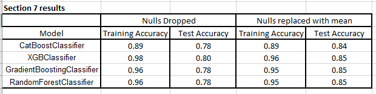
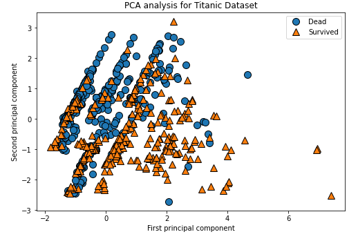
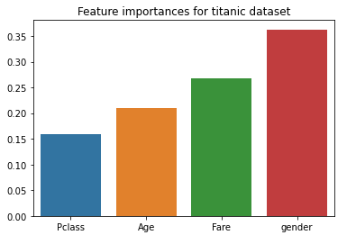
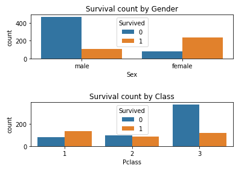
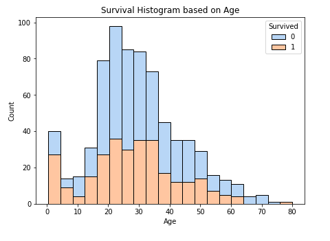
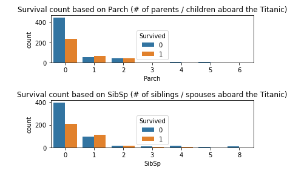
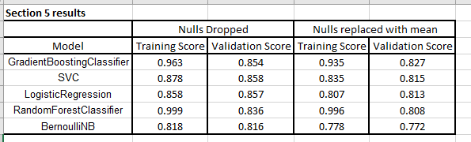
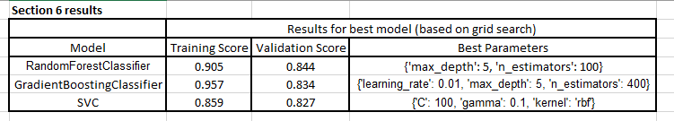
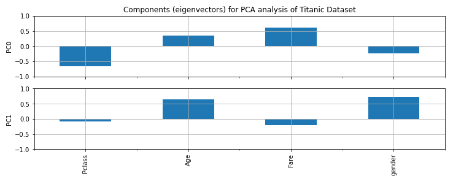
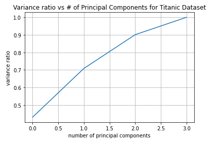

# Titanic Dataset Investigation
*By Graydon Hall*

## Question/Topics being investigated
As my final project for ENSF 611 - Machine Learning for Software Engineers, I'm going to analyze the famous titanic dataset from [this kaggle competition](https://www.kaggle.com/c/titanic). I will explore the following 4 questions:
1. Which model will produce the best results on the testing data
2. Investigating the use of PCA to try and visualize
3. Which featuers are most predictive in this model, and which can be ignored?
4. What is the best strategy for handling the 177 null values which show up in the age column
The full project can be found in the file [GH_final_project.ipynb](GH_final_project.ipynb)

## Summary of Questions Answered/Topics Investigated
### 1. Which model will produce the best results on the testing data
* The top 4 models are given in the following table 
 
* Interestingly enough, Three of the models tie in terms of Validation score
* Therefore, the best classifier for this dataset is a tie between **GradientBoostingClassifier, RandomForestClassifier , and XGBoost.** 

### 2. Investigating the use of PCA to try and visualize 
* The result of trying to visualize things using 2 Principal Component Axis are given in the following figure.  

* Given that all 4 features are quite important in predicting the outcome of survival, it is concluded that using PCA to visualize who survived and did not is not an overly effective tool on this dataset.

### 3. Which featuers are most predictive in this model, and which can be ignored? 
* The following 4 features that we ended up using are:  
 
* All 4 features are important in predicting the survival outcome of the passengers
* Through analysis performed in the lab, the features that were deemed non-important and were therefore disgarded were: PassengerId, Name, Ticket, Cabin, Embarked, Parch, SibSp

### 4. What is the best strategy for handling the null values which show up in the age column
* Through analysis in the lab, it was determined that **replacing the 177 null Ages with the mean age of the dataset yielded the highest accuracies on the testing data**

## Summary of Report by Section

### 0. Function definitions
* In this section, the following functions were defined in order to streamline the analysis process in the lab
    * `plot_confusion_matrix()`: plots a confusion matrix based on y_predicted vs y_true
    * `get_classifier_cv_score()`: gets cross validation score for a classifier
    * `print_grid_search_result()`: for best model from a GridSearchCV object, this prints the parameters, and cross validation training and test score
    * `plot_grid_search_results()` - For grids with 2 hyperparameters, create a heatmap plot of test scores

### 1. Load the titanic dataset
* In this section, we simply load in the titanic dataset
* We drop the following comments off the bat, since they will not be meaningful in our analysis: PassengerId, Name, Ticket, Cabin, Embarked
* For our analysis, in the case of handling the 177 Null age values by simply dropping those rows, that step is performed here.

### 2. Inspect the data through visualizations
Three visualizations were created in this section. Each of them are presented below, along with the conclusions gained from them 
 
Trends we see from these above 2 plots
* females were more likely to survive
* similar numbers survived for each class
* number of deaths were much higher for 3rd class though  
***

 
* From this, we see a clear trend where those who are younger survive at a higher rate. 
*** 

 
* An interesting trend arises here, where those who have 1 sibling/spouse, or who have one parent/child seem to survive at a higher rate. Some possible explanations: 
    * Since we know women survive at a higher rate, the higher survival rate of those SibSp = 1 may be explained by husband wife pairs, where the wife is more likely to survive
    * We know children survive at a higher rate, and that children are most likely travelling alone, therefore the higher survival rate of those with parch >1 is most likely due to the higher survival rate of children
    * To avoid having these trends captured by multiple features, we will drop the Parch and SibSp columns

### 3. Preprocessing
* First, we encode Male and Female into numerical values (ladies = 0, male = 1)
* StandardScaler is then applied to the dataframe, since it is required for some of our classifiers, and will not negatively affect the others who don't technically require it
* For our analysis, in the case of handling the 177 Null age values by filling them with the mean age of the dataset, this is done here. 

### 4. Create training and test sets
* The dataset is split into training and testing data using `train_test_split()`
* 20% of the data is designated for the test set

### 5. Compare models using cross-validation
* We create a list containing a `LogisticRegression()`, `SVC()`, `BernoulliNB()`, `RandomForestClassifier()`, `GradientBoostingClassifier()` objects.

- We then iterate through this list, then:
    - compute the **average precision** using `get_classifier_cv_score()` defined in step 0, 
    - rank the models based on validation **average precision** (best first),
    - and print the ranked models training and validation scores with **3 decimal places**. 
    - We use our training data and 7-fold cross-validation.  
    
- The results are summarized in the following figure:   
- From this, it would appear that dropping the Null rows produces the best results. 
- However, this result is questioned and explored in greater detail in seciction 7, where the actual testing data is used.
- Based on these results, we perform hyper parameter tuning by applying grid search to our `GradientBoostingClassifier`, `RandomForestClassifier`, and `SVC` in step 6. 
- Although random forest had a lower validation score than Logistic Regression, it's extremely high training score makes it an intriguing model to try and tune and improve

### 6. Hyperparameter tuning using grid search
* We erform hyper parameter tuning by applying grid search to our `GradientBoostingClassifier`, `RandomForestClassifier`, and `SVC`.
* The results are summarized in the following table (Note: these scores are based on null values being replaced with the mean, as it is demonstrated in Part 7 of the lab this is the optimal strategy for getting the best results on the testing data) 
 

### 7. Testing out CatBoost, XGBoost, and our best tuned models (GradientBoostingClassifier and RandomForestClassifier)
* in this section, we test out the CatBoost, XGBoost, and our best tuned model (GradientBoostingClassifier and RandomForestClassifier)
* In this section we perform the the training with rows with null ages removed *and* null ages replaced with mean age.
* This information is used in step 8, where we concclude the best strategy for handling the null ages 
 
* Interestingly enough, Three of the models tie in terms of Validation score
* Therefore, the best classifier for this dataset is a tie between **GradientBoostingClassifier, RandomForestClassifier , and XGBoost.** 

### 8. Analysis on how to handle null ages
An interesting dilemma arises with this dataset. We have 890 values, and 177 rows with null ages. This is an issue, since age is a particulary predictive feature. We have 2 options we tested. 
1. Drop rows with null  values (done by including `train = train.dropna()` in step 1.1)
2. Fill null ages with the mean age (done in step 3)

Interestingly enough, when we drop the rows with null values, we get better results in section 5 when performing cross validation: 
 

However, in Section 7 we get better results on the testing data when the Null values are replaced with the mean age instead 
 
Therefore it is concluded that **replacing null values for age with the mean age is the best strategy for handling null ages**

### 9. Visualzing the data using PCA
* In this section, we perform a PCA analysis to examine if the applying PCA might give us a nice way to visualize the data 
 
 
 
* Using PCA and plotting our 2 axis we are able to see a slight trend in who survived, though the analysis is not overly effective
* By plotting the variance ratio vs the number of principal component axis, we see that using 2 principal components, we are only able to explain 70% of the variance, hence explaining why our visualization is not overly effective

### 10. Feature Importances
 
* Analyzing this diagram, we see that all the features we ended up using are relatively important
* This confirms our conclusions we drew in section 2.
* We can explain the importance of each feature as follows
    * **Gender**: important since woment were more likely to survive
    * **Age**: Important since children were more likely to survive
    * **Class and Fare**: important since those in higher classers were more likely to survive